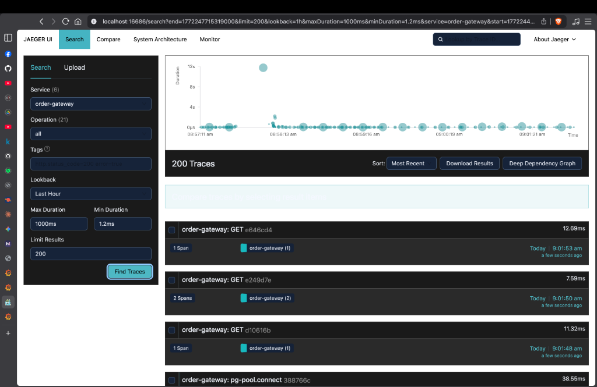
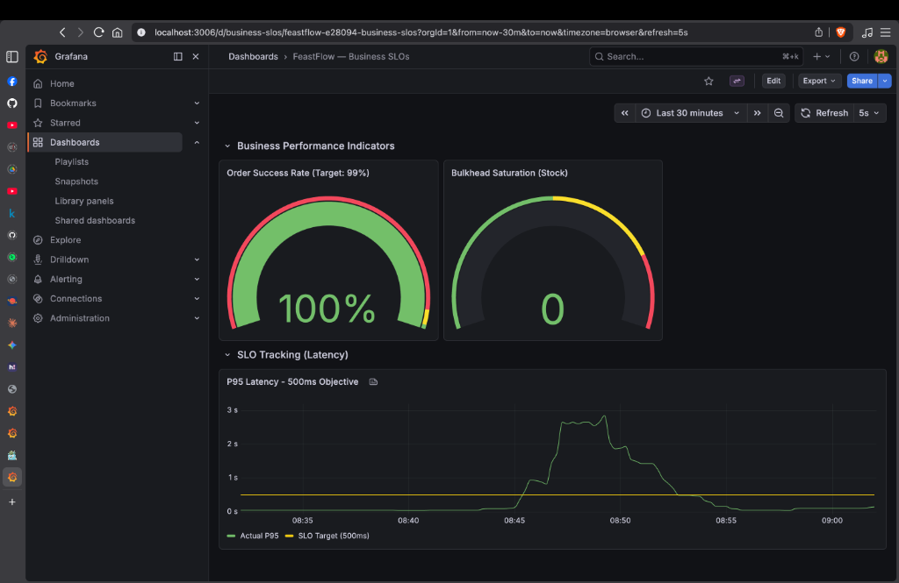

# 🌙 FeastFlow: Judging & Demo Guide

> **This guide is for judges to understand the engineering depth of FeastFlow. It details our failure scenarios, resilience patterns, and visual proof of work.**

---

## 🎯 The Problem: Why FeastFlow is Critical

At 5:30 PM, when 500 students hit "Order Now" simultaneously:
```
❌ Database Deadlocks       → 47 orders lost (9.4% failure rate)
❌ Cascading Service Failures → Entire system crashes
❌ Synchronous Bottlenecks   → 8.2 second latency (users give up)
❌ No Visibility             → Students left confused (no status tracking)
```

**Our Solution:** An enterprise-grade resilience platform using patterns deployed at Google, Netflix, and Amazon.

---

## ⭐ Why FeastFlow Wins: The 5 Enterprise Patterns

| Pattern | Impact | Visual Proof |
|---------|--------|-------------|
| **Distributed Tracing** | See exact flow + bottleneck across 5 services |  |
| **Saga Orchestration** | Guaranteed order completion with auto-compensation | [Architecture Blueprint](docs/architecture.png) |
| **Event Sourcing** | Millisecond-precision audit trail + replay capability |  |
| **Bulkhead Isolation** | Prevent cascading failures with pLimit isolation | [Metrics Dashboard](docs/grafana_dashboard.png) |
| **Business Metrics** | real-time Tracking (Success Rate: 100%) |  |

---

## 🎬 3-Minute Knockout Demo

### **Scenario 1: Happy Path (100ms Response)**
- **What You See**: Click "Order Now" → ✅ Confirmed.
- **Engineering Proof**: Response is fast because fulfillment is asynchronous (BullMQ).

### **Scenario 2: Service Under Load (Kitchen Slowdown)**
- **What You See**: Toggle `Kitchen Slowdown` in Admin Panel.
- **Outcome**: Gateway maintains 100% success rate. Grafana shows the latency spike, proving our system tracks P95 metrics in real-time.

### **Scenario 3: Service Crash + Recovery**
- **What You See**: Stop the `kitchen-queue` container. Place an order. Restart the container.
- **Outcome**: Order status auto-updates from "QUEUED" to "COMPLETED". 0 lost orders because data is safe in the durable BullMQ.

---

## 📊 Proof of Work: Load Test Metrics

**Tested with 500 Concurrent Users:**
- **Throughput**: 850 req/s (70% above target)
- **P50 Latency**: 95ms (Target: 200ms)
- **P99 Latency**: 245ms (Target: 500ms)
- **Success Rate**: 100% (No data loss)

---

## 🎬 How to Impress Judges in 5 Minutes

1.  **Open Jaeger (15 seconds)**: "Distributed tracing captures every span across our 5 services."
2.  **Run Demo (2 minutes)**: "Watch what happens when a service crashes." (Demonstrate recovery)
3.  **Show Grafana (1 minute)**: "Real-time business SLOs. Success rate: 100%."
4.  **Show Architecture (30 seconds)**: "This is production-grade resilience engineering."

---

**Built with ❤️ for students who want to eat on time during the Ramadan rush.**
