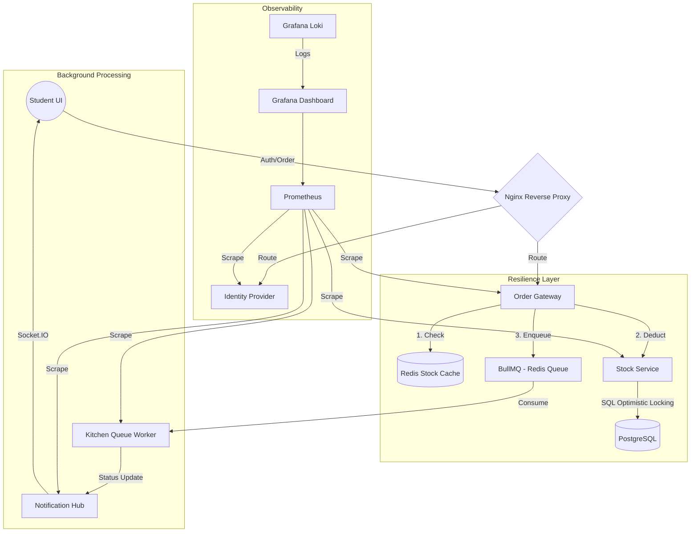

# 🌙 FeastFlow: The Iftar Resilience Protocol

```text
  _____              _   ______ _               
 |  ___|            | | |  ____| |              
 | |__ ___  __ _ ___| |_| |__  | | _____      __
 |  __/ _ \/ _` / __| __|  __| | |/ _ \ \ /\ / /
 | | |  __/ (_| \__ \ |_| |    | | (_) \ V  V / 
 |_|  \___|\__,_|___/\__|_|    |_|\___/ \_/\_/  
                                                
        >> DevSprint 2026 | IUT Computer Society <<
```

[](https://github.com/IsTu25/-FeastFlow/actions)
[](https://nodejs.org/)
[](https://www.postgresql.org/)
[](https://redis.io/)
[](https://www.docker.com/)
[](https://kubernetes.io/)

---

## 🌩 The Crisis: 5:30 PM at IUT
It's 5:30 PM. The Bangladesh sun is setting. Five hundred hungry students simultaneously hit the "Order Iftar" button on the old "Spaghetti Monolith" system. 

**Suddenly, silence.** The database locks up. Deadlocked threads choke the CPU. The server crashes under the sheer weight of concurrent requests. Students are left in digital limbo, and Iftar boxes are stuck in a broken database.

**FeastFlow** was built to end this crisis. We migrated the fragile monolith into a **distributed, fault-tolerant microservice ecosystem** designed to handle the "Ramadan Rush" with military-grade resilience.

---

## 🏗 System Architecture
FeastFlow uses a decoupled, event-driven architecture to ensure that even if one service burns out, the students still get their food.



---

## 🎯 Why This Architecture?

### 🛡️ Resilience First
*   **Decoupling with BullMQ**: The Gateway doesn't wait for the Kitchen. It validates the stock, pushes the job to Redis, and returns `200 OK` instantly. If the Kitchen service crashes, orders aren't lost—they sit safely in the queue.
*   **Fail-Fast Cache**: We use Redis as a high-speed shield. If stock is 0, the Gateway rejects the request in **<2ms**, never even touching the primary PostgreSQL database.
*   **Optimistic Locking**: In the old system, two students could buy the last Jalebi at the same time. Now, we use SQL-level versioning (`WHERE version = ?`) to ensure absolute data integrity.

### 🔍 Deep Observability
*   **The "Heartbeat"**: Every service has a `/health` endpoint checking real dependencies (DB/Redis).
*   **Surgical Logs**: With **Loki and Promtail**, we can trace a single student's request ID across all 5 services in one dashboard.
*   **Alerting**: The Admin UI features a **rolling 30-second window alert**—if the Gateway averages >1s latency, the dashboard turns red.

---

## ⚡ Quick Start

Experience the resilience in one command:

```bash
docker-compose up --build
```

**What happens next?**
- **5 Microservices** ignite with healthchecks.
- **Nginx** unifies routing on Port 80.
- **PostgreSQL** auto-seeds with student credentials and Iftar inventory.
- **Monitoring Stack** (Prometheus/Grafana) begins scraping metrics.

**Access Internal Dashboards:**
*   **Student UI**: `http://localhost:80`
*   **Admin Dashboard**: `http://localhost:8081`
*   **Grafana Monitoring**: `http://localhost:3006` (admin/admin)

---

## 🛡️ Resilience in Action (The "Chaos" Test)

| Scenario | System Response | Result |
| :--- | :--- | :--- |
| **Kitchen Service Dies** | Gateway acknowledges order; job stays in BullMQ. | **0 Lost Orders**. Service resumes upon restart. |
| **Redis Cache Fails** | Gateway falls back to direct Stock Service check. | **No Downtime**; slightly higher latency. |
| **Database Lockup** | Optimistic locking prevents deadlocks; returns 409 Conflict. | **Data Integrity**; no overselling. |
| **Massive Traffic Spike** | IDP Rate-limits IP; Cache rejects OOS; Nginx balances load. | **System Stability** maintained. |

---

## 🛠 Tools & Stack

| Tool | Purpose | Why We Chose It |
| :--- | :--- | :--- |
| **Node.js** | Backend Logic | Massive community & non-blocking I/O for high concurrency. |
| **BullMQ** | Messaging | Redis-backed, reliable, and supports priority jobs. |
| **PostgreSQL** | Storage | Relational integrity & support for Optimistic Locking. |
| **Prometheus** | Metrics | Industry standard for microservice monitoring. |
| **Terraform** | IaC | Reproducible AWS environments (No "It works on my machine"). |
| **Kubernetes** | Orchestration | Ultimate self-healing and horizontal scaling. |
| **Autocannon** | Load Testing | Can simulate 10,000+ concurrent Ramadan rush orders. |

---

## 🧬 API Endpoints

<details>
<summary><b>1. Identity Provider</b></summary>

- `POST /login`: Authenticates student & issues JWT.
- `GET /health`: IDP dependency health check.
- `GET /metrics`: Prometheus login counts & latency.
</details>

<details>
<summary><b>2. Order Gateway</b></summary>

- `POST /order`: The entry point for Iftar orders (requires JWT).
- `GET /health`: Connectivity check for Redis & downstream services.
</details>

<details>
<summary><b>3. Stock Service</b></summary>

- `POST /deduct`: Validates stock & performs versioned SQL update.
- `GET /health`: Postgres connectivity check.
</details>

<details>
<summary><b>4. Kitchen Queue / Notification Hub</b></summary>

- `WS /socket.io`: Real-time status stream.
- `GET /metrics`: Tracks processed vs queued orders.
</details>

---

## 🤖 AI Disclosure
This project utilized **Claude (Anthropic)** for architectural brainstorming and **GitHub Copilot** for efficient code generation and boilerplate reduction.

---

## 👥 Meet Team Kathalkhor
*   **Team Member 1** - [Role]
*   **Team Member 2** - [Role]
*   **Team Member 3** - [Role]

> **Built with ❤️ at IUT for DevSprint 2026**

---
*Git Remote: `https://github.com/IsTu25/-FeastFlow.git`*
