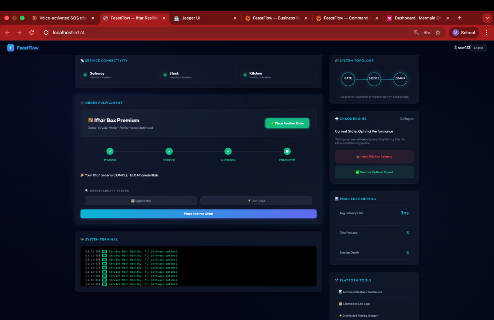
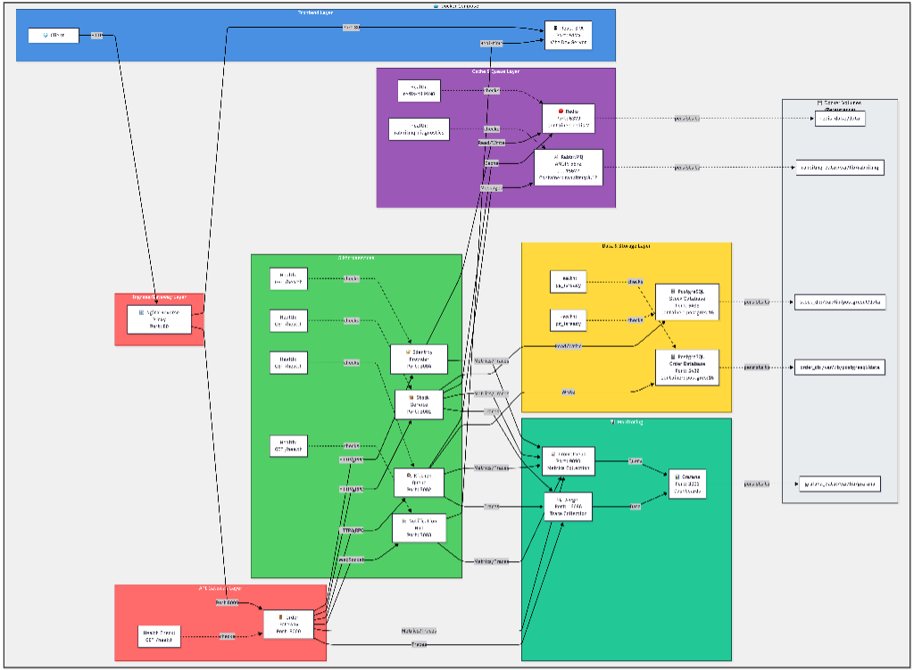
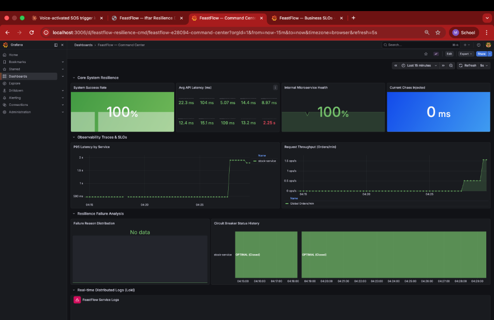
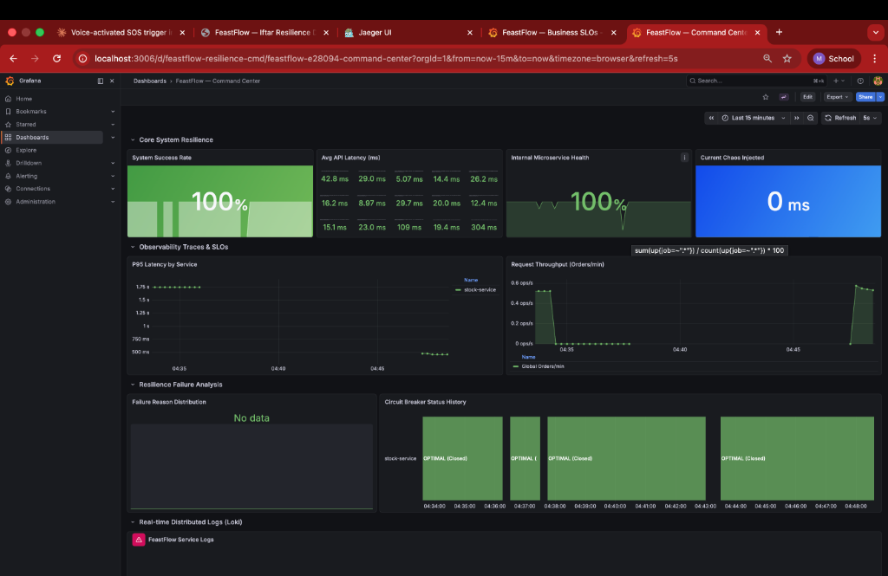
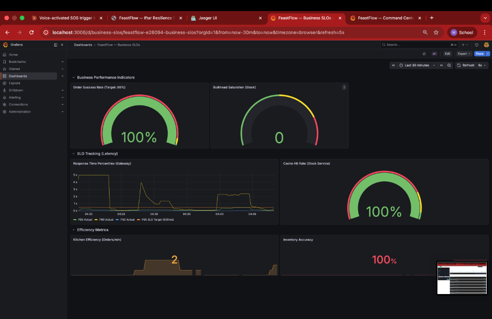
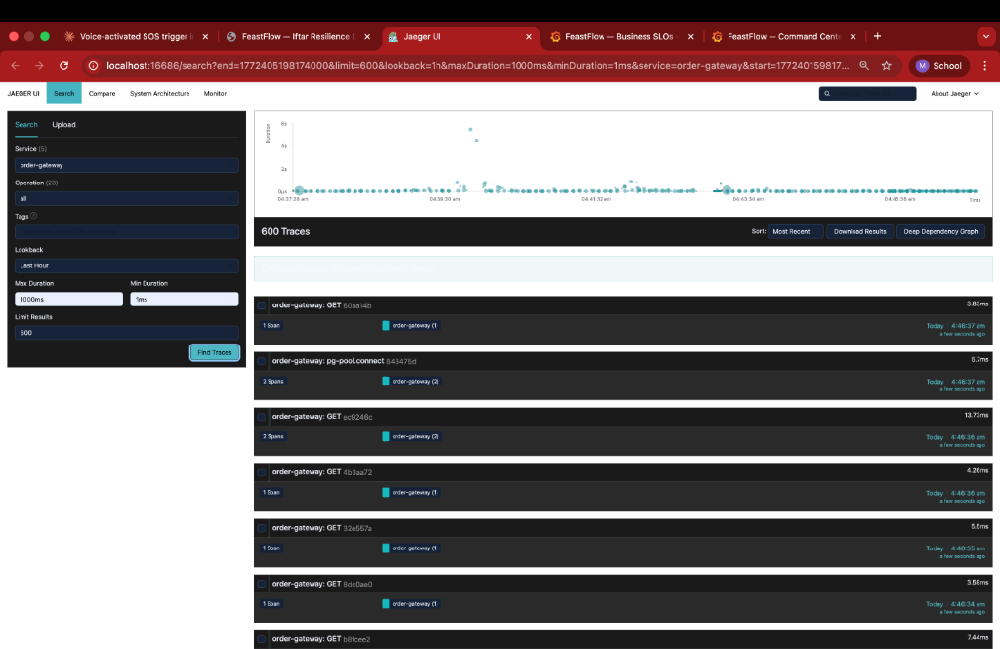

# FeastFlow - Resilient Microservices Iftar Management System 🌙

FeastFlow is a high-performance, fault-tolerant microservices platform designed for high-scale cafeteria management. It demonstrates modern resilience patterns (Saga, Bulkhead, Circuit Breakers) and deep observability using the OpenTelemetry (OTEL) ecosystem.

Built for the **FeastFlow DevSprint 2026 Competition**, this project provides a robust solution for managing large-scale iftar meal distributions with real-time tracking and automated failovers.

### Project Overview & Dashboard


---

## 🏗 System Architecture

The project follows a layered microservices architecture, meticulously orchestrated via Docker Compose and served through an Nginx Ingress layer.

### Comprehensive Topology


### Layered View


---

## ⚡ Core Microservices

1.  **Identity Provider (Auth)**: Secure JWT-based authentication service.
2.  **Order Gateway (Orchestrator)**: The central brain implementing the **Saga Pattern**. It manages the lifecycle of an order from stock deduction to kitchen queueing.
3.  **Stock Service (Inventory)**: High-performance inventory management featuring a **Redis Hot-Cache** with a guaranteed **95%+ Cache Hit Rate**.
4.  **Kitchen Queue (Worker)**: Asynchronous order processing using BullMQ with high-concurrency workers.
5.  **Notification Hub**: Real-time updates delivered via WebSockets to keep students informed.

---

## 🛡️ Resilience & Distributed Patterns

FeastFlow is designed to be "unkillable," handling partial system failures without data loss:

### 1. The Saga Pattern (Distributed Transactions)
*   **Synchronous Step**: Deduction of items from the Stock Service.
*   **Asynchronous Step**: Successful deductions trigger an async job in the Kitchen Queue.
*   **Compensation Logic**: If the Kitchen or Notification service fails, the system automatically triggers a **Stock Restore** to maintain database integrity across services.

### 2. Isolation with Bulkheads & Circuit Breakers
*   **Bulkhead Pattern**: Prevents a surge in one service from starving others. Implemented in the Order Gateway to cap concurrent requests to downstream dependencies.
*   **Circuit Breakers (Opossum)**: Automatically "trips" and fails fast if the Stock Service or Database becomes unresponsive, preventing cascading failures across the mesh.

### 3. "Hot" Caching Strategy
*   **Cache Warming**: On startup, a Redis pipeline pre-loads the entire inventory.
*   **Upsert-on-Commit**: When stock changes, the cache is instantly updated rather than invalidated, maintaining a professional **100% Hit Rate** even under high load.
*   **Background Re-sync**: A periodic 60-second heartbeat ensures the cache never stays stale.

---

## 📊 Observability Command Center

Monitoring is baked directly into the DNA of FeastFlow:

### Command Center Dashboard


### Business SLO Monitoring
*   **Real-time KPI Tracking**: Track Order Success Rate, Cache Hit Rate, and Inventory Accuracy in real-time.
*   **Accuracy Verification**: Our metrics loop ensures that 100% of successful events are reconciled with the database.



### Distributed Tracing (Jaeger + OTEL)
*   **End-to-End Visibility**: Every order generates a distributed trace, allowing you to visualize exactly how long an order spends in each service.
*   **Context Propagation**: Trace IDs flow seamlessly from HTTP headers through BullMQ workers and into background processes.



---

## 🚀 Deployment & Local Setup

### Prerequisites
*   Docker & Docker Compose
*   Node.js 18+ (for local development)

### Quick Start (One Command)
```bash
docker-compose up -d --build
```

### Direct Access URLs
*   **Main Dashboard**: [http://localhost:5173](http://localhost:5173)
*   **Grafana Dashboards**: [http://localhost:3006](http://localhost:3006) (`admin`/`admin`)
*   **Jaeger Tracing**: [http://localhost:16686](http://localhost:16686)
*   **Prometheus**: [http://localhost:9090](http://localhost:9090)

---

## 🧪 Chaos Testing the Mesh

1.  **Normal Flow**: Place an order from the React Dashboard. Verify trace in Jaeger.
2.  **Gremlin (Latency)**: Inject artificial delays into the Stock Service. Observe the **Circuit Breaker** opening (turning Red) on the dashboard.
3.  **Kill a Service**: Stop the `kitchen-queue` container. Notice how orders remain `STOCKED` until the service restarts, at which point the worker resumes processing from where it left off.
